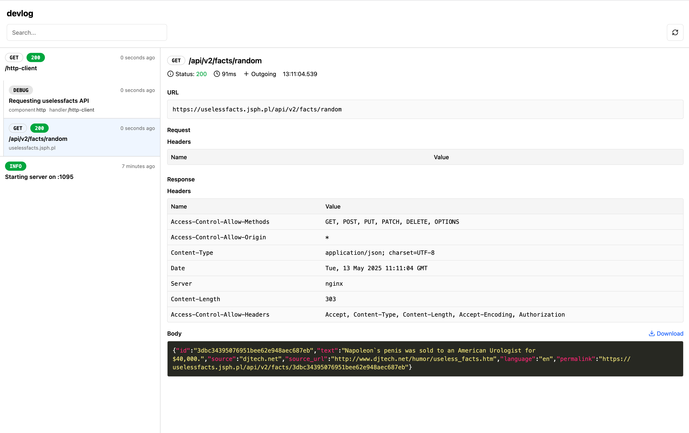

# devlog

A lightweight, embeddable development dashboard for Go applications. Monitor logs, HTTP requests (client and server), and SQL queries all in one place with minimal setup.



## Features

- **Logs**: Capture and browse structured logs with filtering and detail view
- **HTTP Client**: Monitor outgoing HTTP requests with timing, headers, and response info
- **HTTP Server**: Track incoming HTTP requests to your application
- **SQL Queries**: Monitor database queries with timing and arguments
- **On-Demand Capture**: Start/stop capturing through the dashboard UI with session or global modes
- **Multi-User Isolation**: Each user gets their own event storage with independent clearing
- **Low Overhead**: Designed to be lightweight; no events captured until you start a session
- **Easy to Integrate**: Embeds into your application with minimal configuration
- **Realtime**: See events as they occur via Server-Sent Events
- **Clean UI**: Modern, minimalist interface with responsive design

## Note

Make sure to not activate `devlog` in production systems! It can expose sensible data like API tokens and other secret data in requests and responses.
We currently do not have any protection of the dashboard handler routes in place.

## Installation

```bash
go get github.com/networkteam/devlog
```

## Quick Start

```go
package main

import (
	"log/slog"
	"net/http"
	"os"

	"github.com/networkteam/devlog"
	"github.com/networkteam/devlog/collector"
)

func main() {
	// 1. Create a new devlog dashboard
	dlog := devlog.New()
	defer dlog.Close()

	// 2. Set up slog with devlog middleware
	logger := slog.New(
		dlog.CollectSlogLogs(collector.CollectSlogLogsOptions{
			Level: slog.LevelDebug,
		}),
	)
	slog.SetDefault(logger)

	// 3. Create a mux and mount the dashboard
	mux := http.NewServeMux()
	
	// Mount under path prefix /_devlog, so we handle the dashboard handler under this path
	// Strip the prefix, so dashboard routes match and inform it about the path prefix to render correct URLs
	mux.Handle("/_devlog/", http.StripPrefix("/_devlog", dlog.DashboardHandler("/_devlog")))

	// 4. Add your application routes
	mux.HandleFunc("/", func(w http.ResponseWriter, r *http.Request) {
		slog.Info("Request received", "path", r.URL.Path)
		w.Write([]byte("Hello, devlog!"))
	})

	// 5. Wrap your handler to capture HTTP requests
	handler := dlog.CollectHTTPServer(mux)

	// 6. Start the server
	slog.Info("Starting server on :8080")
	slog.Info("Dashboard available at http://localhost:8080/_devlog/")
	if err := http.ListenAndServe(":8080", handler); err != nil {
		slog.Error("Failed to start server", "error", err.Error())
		os.Exit(1)
	}
}
```

Visit `http://localhost:8080/_devlog/` to access the dashboard.

## Complete Example

See [example](example/main.go) for a more complete example showing all features.

## Usage

### Capture Sessions

By default, no events are collected until a user starts a capture session through the dashboard UI. This on-demand approach:

- Reduces overhead when not actively debugging
- Provides isolation between users (each gets their own event storage)
- Allows clearing events without affecting other users

**Capture Modes:**

- **Session Mode** (default): Only captures events from HTTP requests that include your session cookie. Useful for isolating your own requests in a shared environment.
- **Global Mode**: Captures all events from all requests. Useful when you need to see everything happening in the application.

Toggle between modes using the buttons in the dashboard header.

### Capturing Logs

devlog integrates with Go's `slog` package:

```go
dlog := devlog.New()

logger := slog.New(
    dlog.CollectSlogLogs(collector.CollectSlogLogsOptions{
		Level: slog.LevelDebug, // Capture logs at debug level and above
	}),
)
slog.SetDefault(logger)

// Now use slog as normal
slog.Info("Hello, world!", "foo", "bar")
slog.Debug("Debug info", 
	slog.Group("details",
		slog.Int("count", 42),
		slog.String("status", "active"),
	),
)
```

### Capturing HTTP Client Requests

Wrap your HTTP clients to capture outgoing requests:

```go
// Wrap an existing client
client := &http.Client{
    Transport: dlog.CollectHTTPClient(http.DefaultTransport),
    Timeout:   10 * time.Second,
}

// Now use the wrapped client
resp, err := client.Get("https://example.com")
```

### Capturing Incoming HTTP Requests

Wrap your HTTP handlers to capture incoming requests:

```go
mux := http.NewServeMux()
// Add your routes to mux...

// Wrap the handler
handler := dlog.CollectHTTPServer(mux)

// Use the wrapped handler
http.ListenAndServe(":8080", handler)
```

### Capturing SQL Queries

Devlog can collect SQL queries executed through the standard `database/sql` package. This is done using the `go-sqllogger` adapter.

### Setup

1. First, create a devlog instance:

```go
dlog := devlog.New()
defer dlog.Close()
```

2. Create a database connector with logging:

```go
// Create your base connector (e.g., for SQLite)
connector := newSQLiteConnector(":memory:")

// Wrap it with the logging connector
loggingConnector := sqllogger.LoggingConnector(
    sqlloggeradapter.New(dlog.CollectDBQuery()),
    connector,
)

// Open the database with the logging connector
db := sql.OpenDB(loggingConnector)
defer db.Close()
```

### What Gets Collected

For each SQL query, the following information is collected:
- The SQL query string
- Query arguments
- Execution duration
- Timestamp

### Example

Here's a complete example showing how to use the SQL query collector:

```go
package main

import (
    "database/sql"
    _ "github.com/mattn/go-sqlite3"
    "github.com/networkteam/go-sqllogger"
    sqlloggeradapter "github.com/networkteam/devlog/dbadapter/sqllogger"
    "github.com/networkteam/devlog"
)

func main() {
    // Create devlog instance
    dlog := devlog.New()
    defer dlog.Close()

    // Create database connector with logging
    connector := newSQLiteConnector(":memory:")
    loggingConnector := sqllogger.LoggingConnector(
        sqlloggeradapter.New(dlog.CollectDBQuery()),
        connector,
    )

    // Open database
    db := sql.OpenDB(loggingConnector)
    defer db.Close()

    // Execute queries - they will be automatically collected
    db.ExecContext(ctx, "CREATE TABLE users (id INTEGER PRIMARY KEY, name TEXT)")
    db.QueryContext(ctx, "SELECT * FROM users WHERE id = ?", 1)
}
```

### Using SQLite as a `driver.Connector`

```go
// sqliteConnector is a simple implementation of driver.Connector for SQLite
type sqliteConnector struct {
	driver *sqlite3.SQLiteDriver
	dsn    string
}

func newSQLiteConnector(dsn string) *sqliteConnector {
	sqliteDriver := &sqlite3.SQLiteDriver{}
	return &sqliteConnector{
		driver: sqliteDriver,
		dsn:    dsn,
	}
}

// Connect implements driver.Connector interface
func (c *sqliteConnector) Connect(ctx context.Context) (driver.Conn, error) {
	return c.driver.Open(c.dsn)
}

// Driver implements driver.Connector interface
func (c *sqliteConnector) Driver() driver.Driver {
	return c.driver
}
```

The collected queries will be visible in the devlog dashboard, showing:
- The SQL query (truncated in the list view, full query in details)
- Query arguments
- Execution duration in milliseconds

### Configuring the Dashboard

Use functional options to customize the dashboard handler:

```go
mux.Handle("/_devlog/", http.StripPrefix("/_devlog", dlog.DashboardHandler("/_devlog",
	dashboard.WithStorageCapacity(5000),           // Events per user (default: 1000)
	dashboard.WithSessionIdleTimeout(time.Minute), // Cleanup timeout (default: 30s)
	dashboard.WithTruncateAfter(100),              // Limit displayed events
)))
```

### Configuring Collectors

Use options to customize collector behavior:

```go
dlog := devlog.NewWithOptions(devlog.Options{
	HTTPServerOptions: &collector.HTTPServerOptions{
		CaptureRequestBody:  true,
		CaptureResponseBody: true,
		MaxBodySize:         1024 * 1024,          // 1MB max body capture
		SkipPaths:           []string{"/_devlog"}, // Skip dashboard routes
	},
	HTTPClientOptions: &collector.HTTPClientOptions{
		CaptureRequestBody:  true,
		CaptureResponseBody: true,
		MaxBodySize:         1024 * 1024,
	},
})
```

## Development

### Running Acceptance Tests

The project includes Playwright-based acceptance tests that verify the dashboard UI works correctly with the backend.

**Prerequisites:**

Playwright browsers will be automatically installed on first run.

**Run all acceptance tests:**

```bash
go test -v -timeout 5m ./acceptance/...
```

**Debug mode (visible browser):**

```bash
HEADLESS=false go test -v -parallel=1 ./acceptance/...
```

The acceptance tests cover:
- Dashboard access and session management
- Global and session capture modes
- Event capturing and display (HTTP server/client, logs, DB queries)
- SSE real-time updates
- Mode switching and event clearing

## TODOs

- [ ] Add support for generic events/groups that can be used in user-code
- [ ] Add pretty printing of JSON
- [ ] Implement ad-hoc change of log level via slog.Leveler via UI
- [ ] Implement filtering of events

## License

MIT

## Credits

- Created by [networkteam](https://networkteam.com)
- Uses [templ](https://github.com/a-h/templ) for HTML templating
- Uses [htmx](https://htmx.org/) for UI interactivity
