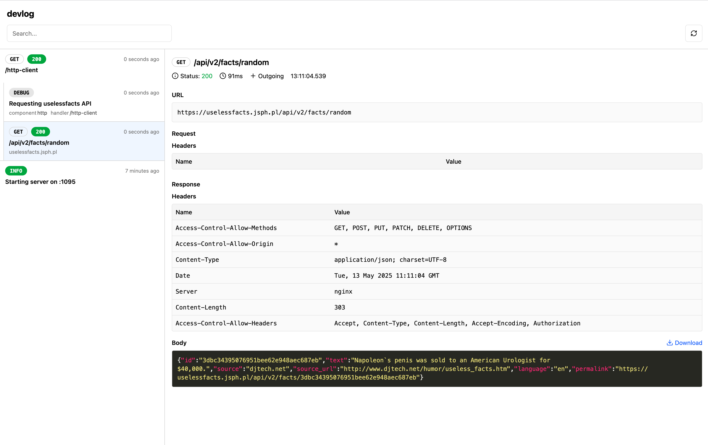

# devlog

A lightweight, embeddable development dashboard for Go applications. Monitor logs, HTTP requests (client and server), and SQL queries all in one place with minimal setup.



## Features

- **Logs**: Capture and browse structured logs with filtering and detail view
- **HTTP Client**: Monitor outgoing HTTP requests with timing, headers, and response info
- **HTTP Server**: Track incoming HTTP requests to your application
- **SQL Queries**: Monitor database queries with timing and arguments
- **On-Demand Capture**: Start/stop capturing through the dashboard UI with session or global modes
- **Agent Access (MCP)**: Expose captured events to AI coding agents over the Model Context Protocol (opt-in)
- **Multi-User Isolation**: Each user gets their own event storage with independent clearing
- **Low Overhead**: Designed to be lightweight; no events captured until you start a session
- **Easy to Integrate**: Embeds into your application with minimal configuration
- **Realtime**: See events as they occur via Server-Sent Events
- **Clean UI**: Modern, minimalist interface with responsive design

## Production Use

devlog can be used in production to inspect requests and debug issues in real-time. Session mode is particularly useful here - each developer only sees events from their own requests, avoiding noise from other users.

**Important:** The dashboard can expose sensitive data like API tokens and secrets in requests and responses. Make sure to protect the dashboard routes with your own authentication middleware.

## Installation

```bash
go get github.com/networkteam/devlog
```

## Quick Start

```go
package main

import (
	"log/slog"
	"net/http"
	"os"

	"github.com/networkteam/devlog"
	"github.com/networkteam/devlog/collector"
)

func main() {
	// 1. Create a new devlog dashboard
	dlog := devlog.New()
	defer dlog.Close()

	// 2. Set up slog with devlog middleware
	logger := slog.New(
		dlog.CollectSlogLogs(collector.CollectSlogLogsOptions{
			Level: slog.LevelDebug,
		}),
	)
	slog.SetDefault(logger)

	// 3. Create a mux and mount the dashboard
	mux := http.NewServeMux()
	
	// Mount under path prefix /_devlog, so we handle the dashboard handler under this path
	// Strip the prefix, so dashboard routes match and inform it about the path prefix to render correct URLs
	mux.Handle("/_devlog/", http.StripPrefix("/_devlog", dlog.DashboardHandler("/_devlog")))

	// 4. Add your application routes
	mux.HandleFunc("/", func(w http.ResponseWriter, r *http.Request) {
		slog.Info("Request received", "path", r.URL.Path)
		w.Write([]byte("Hello, devlog!"))
	})

	// 5. Wrap your handler to capture HTTP requests
	handler := dlog.CollectHTTPServer(mux)

	// 6. Start the server
	slog.Info("Starting server on :8080")
	slog.Info("Dashboard available at http://localhost:8080/_devlog/")
	if err := http.ListenAndServe(":8080", handler); err != nil {
		slog.Error("Failed to start server", "error", err.Error())
		os.Exit(1)
	}
}
```

Visit `http://localhost:8080/_devlog/` to access the dashboard.

## Complete Example

See [example](example/main.go) for a more complete example showing all features.

## Usage

### Capture Sessions

By default, no events are collected until a user starts a capture session through the dashboard UI. This on-demand approach:

- Reduces overhead when not actively debugging
- Provides isolation between users (each gets their own event storage)
- Allows clearing events without affecting other users

**Capture Modes:**

- **Session Mode** (default): Only captures events from HTTP requests that include your session cookie. Useful for isolating your own requests in a shared environment.
- **Global Mode**: Captures all events from all requests. Useful when you need to see everything happening in the application.

Toggle between modes using the buttons in the dashboard header.

### Capturing Logs

devlog integrates with Go's `slog` package:

```go
dlog := devlog.New()

logger := slog.New(
    dlog.CollectSlogLogs(collector.CollectSlogLogsOptions{
		Level: slog.LevelDebug, // Capture logs at debug level and above
	}),
)
slog.SetDefault(logger)

// Now use slog as normal
slog.Info("Hello, world!", "foo", "bar")
slog.Debug("Debug info", 
	slog.Group("details",
		slog.Int("count", 42),
		slog.String("status", "active"),
	),
)
```

### Capturing HTTP Client Requests

Wrap your HTTP clients to capture outgoing requests:

```go
// Wrap an existing client
client := &http.Client{
    Transport: dlog.CollectHTTPClient(http.DefaultTransport),
    Timeout:   10 * time.Second,
}

// Now use the wrapped client
resp, err := client.Get("https://example.com")
```

### Capturing Incoming HTTP Requests

Wrap your HTTP handlers to capture incoming requests:

```go
mux := http.NewServeMux()
// Add your routes to mux...

// Wrap the handler
handler := dlog.CollectHTTPServer(mux)

// Use the wrapped handler
http.ListenAndServe(":8080", handler)
```

### Capturing SQL Queries

Devlog can collect SQL queries executed through the standard `database/sql` package. This is done using the `go-sqllogger` adapter.

### Setup

1. First, create a devlog instance:

```go
dlog := devlog.New()
defer dlog.Close()
```

2. Create a database connector with logging:

```go
// Create your base connector (e.g., for SQLite)
connector := newSQLiteConnector(":memory:")

// Wrap it with the logging connector
loggingConnector := sqllogger.LoggingConnector(
    sqlloggeradapter.New(dlog.CollectDBQuery()),
    connector,
)

// Open the database with the logging connector
db := sql.OpenDB(loggingConnector)
defer db.Close()
```

### What Gets Collected

For each SQL query, the following information is collected:
- The SQL query string
- Query arguments
- Execution duration
- Timestamp

### Example

Here's a complete example showing how to use the SQL query collector:

```go
package main

import (
    "database/sql"
    _ "github.com/mattn/go-sqlite3"
    "github.com/networkteam/go-sqllogger"
    sqlloggeradapter "github.com/networkteam/devlog/dbadapter/sqllogger"
    "github.com/networkteam/devlog"
)

func main() {
    // Create devlog instance
    dlog := devlog.New()
    defer dlog.Close()

    // Create database connector with logging
    connector := newSQLiteConnector(":memory:")
    loggingConnector := sqllogger.LoggingConnector(
        sqlloggeradapter.New(dlog.CollectDBQuery()),
        connector,
    )

    // Open database
    db := sql.OpenDB(loggingConnector)
    defer db.Close()

    // Execute queries - they will be automatically collected
    db.ExecContext(ctx, "CREATE TABLE users (id INTEGER PRIMARY KEY, name TEXT)")
    db.QueryContext(ctx, "SELECT * FROM users WHERE id = ?", 1)
}
```

### Using SQLite as a `driver.Connector`

```go
// sqliteConnector is a simple implementation of driver.Connector for SQLite
type sqliteConnector struct {
	driver *sqlite3.SQLiteDriver
	dsn    string
}

func newSQLiteConnector(dsn string) *sqliteConnector {
	sqliteDriver := &sqlite3.SQLiteDriver{}
	return &sqliteConnector{
		driver: sqliteDriver,
		dsn:    dsn,
	}
}

// Connect implements driver.Connector interface
func (c *sqliteConnector) Connect(ctx context.Context) (driver.Conn, error) {
	return c.driver.Open(c.dsn)
}

// Driver implements driver.Connector interface
func (c *sqliteConnector) Driver() driver.Driver {
	return c.driver
}
```

The collected queries will be visible in the devlog dashboard, showing:
- The SQL query (truncated in the list view, full query in details)
- Query arguments
- Execution duration in milliseconds

### Configuring the Dashboard

Use functional options to customize the dashboard handler:

```go
mux.Handle("/_devlog/", http.StripPrefix("/_devlog", dlog.DashboardHandler("/_devlog",
	dashboard.WithStorageCapacity(5000),           // Events per user (default: 1000)
	dashboard.WithSessionIdleTimeout(time.Minute), // Cleanup timeout (default: 30s)
	dashboard.WithTruncateAfter(100),              // Limit displayed events
)))
```

### Configuring Collectors

Use options to customize collector behavior:

```go
dlog := devlog.NewWithOptions(devlog.Options{
	HTTPServerOptions: &collector.HTTPServerOptions{
		CaptureRequestBody:  true,
		CaptureResponseBody: true,
		MaxBodySize:         1024 * 1024,          // 1MB max body capture
		SkipPaths:           []string{"/_devlog"}, // Skip dashboard routes
	},
	HTTPClientOptions: &collector.HTTPClientOptions{
		CaptureRequestBody:  true,
		CaptureResponseBody: true,
		MaxBodySize:         1024 * 1024,
	},
})
```

## Agent Access (MCP)

devlog can expose its captured events to AI coding agents (Claude Code, Cursor, …) over the
[Model Context Protocol](https://modelcontextprotocol.io). An agent can then list requests,
inspect SQL queries and logs, fetch bodies, and control capture — giving it the same context a
developer reads in the dashboard.

This consists of two parts:

1. A read-only **Agent JSON API** mounted on the dashboard handler (under `/api/agent/v1/`).
2. The **`devlog` CLI** (`./cli` module), which exposes that API to an agent over MCP.

> The browser-relayed variant for **deployed** (stage/production) instances is a separate, planned
> phase. What is described here is the local-development path. See
> [`docs/design/agent-access.md`](docs/design/agent-access.md) and
> [`docs/design/agent-access-relay.md`](docs/design/agent-access-relay.md) for the full design.

### Enabling the API

The Agent JSON API is **off by default** — unlike the dashboard UI (which shows data to a human on
screen), the agent API is consumed by tools that may forward data to third-party LLM providers, so
it must be enabled deliberately. Enable it with `WithAgentAPI()`:

```go
mux.Handle("/_devlog/", http.StripPrefix("/_devlog", dlog.DashboardHandler("/_devlog",
	dashboard.WithAgentAPI(),
)))
```

It inherits whatever authentication middleware you have placed in front of the dashboard.

#### Redaction

Sensitive header values are masked by default (`Authorization`, `Cookie`, `Set-Cookie`,
`WWW-Authenticate`, `Proxy-Authenticate`, `Proxy-Authorization`), with the key preserved so an agent
can tell a header is redacted rather than absent. Request/response bodies are never inlined in list
or detail responses — only metadata is — and are served (capped) by dedicated endpoints.

```go
dlog.DashboardHandler("/_devlog",
	dashboard.WithAgentAPI(),
	dashboard.WithAgentRedactedHeaders("X-Api-Key"),    // mask additional headers
	dashboard.WithAgentMaxBodyBytes(64*1024),           // cap body bytes served (default: 64 KiB)
	dashboard.WithAgentRedactor(func(d *dashboard.EventDetail) *dashboard.EventDetail {
		// Mutate the detail (e.g. clear d.RequestBody.Available to suppress a body),
		// or return nil to drop the event from the agent API entirely.
		return d
	}),
	// dashboard.WithAgentInsecureHeaders(),            // disable header masking (local dev only)
)
```

#### Endpoints

All responses are JSON; errors use `{"error": "..."}`. `{sid}` is the capture session id.

| Method | Path | Purpose |
|--------|------|---------|
| GET  | `/api/agent/v1/s/{sid}/events` | Event summaries, newest first. Filters: `type`, `since`/`until` (RFC 3339), `limit`, `status` (e.g. `5xx`), `path` |
| GET  | `/api/agent/v1/s/{sid}/events/{id}` | Full event detail incl. child events and body metadata |
| GET  | `/api/agent/v1/s/{sid}/events/{id}/request-body` | Raw request body (redaction- and cap-aware) |
| GET  | `/api/agent/v1/s/{sid}/events/{id}/response-body` | Raw response body (redaction- and cap-aware) |
| GET  | `/api/agent/v1/s/{sid}/capture/status` | `{active, mode, eventCount}` (read-only; capture is started/stopped by the user in the dashboard) |
| GET  | `/api/agent/v1/sessions` | List active capture sessions (for the relay to attach to) |
| GET  | `/api/agent/v1/stats` | Memory and event statistics |

### The `devlog` CLI

The CLI lives in the `./cli` module and bridges the JSON API to an agent over MCP. In `--direct`
mode it talks to a local devlog instance over plain HTTP — no browser tunnel involved.

The relay does **not** create its own capture session — it **attaches to an existing one** so the
agent and your dashboard see the same events. Open the dashboard and start a capture first, then:

```bash
# from the repository root (workspace) or the ./cli module
go run ./cli relay --direct http://localhost:8080/_devlog --mcp-port 4319

# or build a binary
go build -C cli -o devlog .
./cli/devlog relay --direct http://localhost:8080/_devlog --mcp-port 4319
```

On startup the relay lists active sessions: if exactly one is active it attaches automatically; if
several are, it prompts you to choose; if none exist yet it waits until one appears. Use
`--session <sid>` (the id from the dashboard URL) to attach non-interactively. Because the dashboard
tab owns the session, no agent-side lifetime management is needed — when you close the dashboard the
session ends normally.

The relay binds to `127.0.0.1` only and serves an MCP endpoint at `http://127.0.0.1:<port>/mcp`. The
endpoint validates the `Host` header is a loopback literal to block DNS-rebinding from a browser.

MCP tools exposed (all read-only): `list_events`, `get_event`, `get_request_body`,
`get_response_body`, `capture_status`, `get_stats`, `list_environments`. The agent cannot start or
stop capture — you manage capture from the dashboard; the agent only piggy-backs on your session.

### Integrating with an agent

For an MCP client that supports streamable-HTTP servers (e.g. Claude Code), point it at the relay's
MCP URL. With Claude Code, add a project-scoped `.mcp.json`:

```json
{
  "mcpServers": {
    "devlog": {
      "type": "http",
      "url": "http://127.0.0.1:4319/mcp"
    }
  }
}
```

Keep the relay running while the agent is connected. A typical flow: you open the dashboard and start
capturing, the relay attaches to that session, you exercise the application, then the agent calls
`list_events` / `get_event` to inspect what happened. Capture is forward-looking — events are
captured from the moment capture starts in the dashboard.

### Security notes

- **Opt-in and auth-inherited.** The API is disabled unless `WithAgentAPI()` is set and is protected
  by your existing dashboard authentication middleware.
- **Egress awareness.** Data returned to an agent may be sent to an LLM provider. Default header
  redaction and the body size cap limit exposure; add a `WithAgentRedactor` for application-specific
  scrubbing, and prefer leaving the API off where regulated data flows through.
- **Loopback only.** The CLI binds to `127.0.0.1` and rejects non-loopback `Host` headers on the MCP
  endpoint.

## Development

### Running Acceptance Tests

The project includes Playwright-based acceptance tests that verify the dashboard UI works correctly with the backend.

**Prerequisites:**

Playwright browsers will be automatically installed on first run.

**Run all acceptance tests:**

```bash
go test -v -timeout 5m ./acceptance/...
```

**Debug mode (visible browser):**

```bash
HEADLESS=false go test -v -parallel=1 ./acceptance/...
```

The acceptance tests cover:
- Dashboard access and session management
- Global and session capture modes
- Event capturing and display (HTTP server/client, logs, DB queries)
- SSE real-time updates
- Mode switching and event clearing

## TODOs

- [ ] Add support for generic events/groups that can be used in user-code
- [ ] Add pretty printing of JSON
- [ ] Implement ad-hoc change of log level via slog.Leveler via UI
- [ ] Implement filtering of events

## License

MIT

## Credits

- Created by [networkteam](https://networkteam.com)
- Uses [templ](https://github.com/a-h/templ) for HTML templating
- Uses [htmx](https://htmx.org/) for UI interactivity
